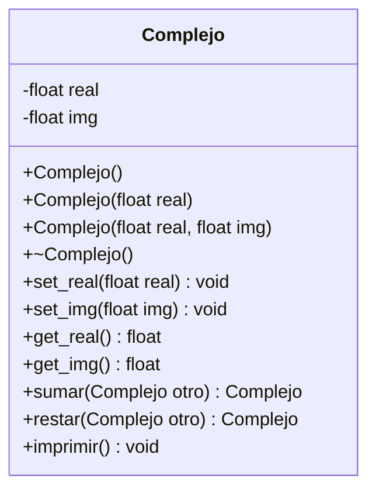

# A2 – Números complejos

## Diagrama de clase

```mermaid
classDiagram
    class Complejo {
        -float real
        -float img
        +Complejo()
        +Complejo(float real)
        +Complejo(float real, float img)
        +~Complejo()
        +set_real(float real) void
        +set_img(float img) void
        +get_real() float
        +get_img() float
        +sumar(Complejo otro) Complejo
        +restar(Complejo otro) Complejo
        +imprimir() void
    }
```

## Fórmulas

- z1 + z2 = (x1 + x2) + (y1 + y2)i
- z1 − z2 = (x1 − x2) + (y1 − y2)i
