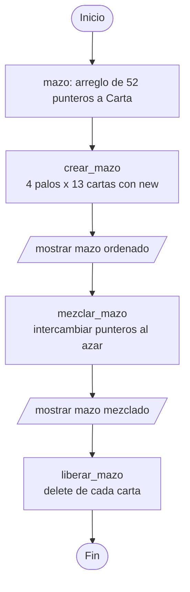
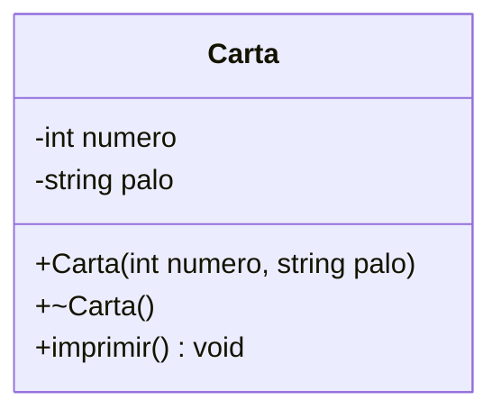

# B2 – El juego de cartas

Continuación de B1: reutiliza la clase `Carta`.

## Diagrama de flujo

```mermaid
flowchart TD
    A([Inicio]) --> B["mazo: arreglo de 52 punteros a Carta"]
    B --> C["crear_mazo<br/>4 palos x 13 cartas con new"]
    C --> D[/mostrar mazo ordenado/]
    D --> E["mezclar_mazo<br/>intercambiar punteros al azar"]
    E --> F[/mostrar mazo mezclado/]
    F --> G["liberar_mazo<br/>delete de cada carta"]
    G --> H([Fin])
```

## Diagrama de clase

```mermaid
classDiagram
    class Carta {
        -int numero
        -string palo
        +Carta(int numero, string palo)
        +~Carta()
        +imprimir() void
    }
```
