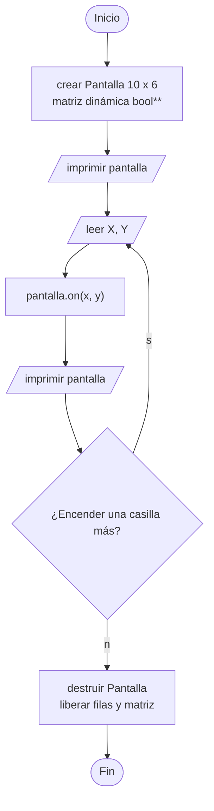
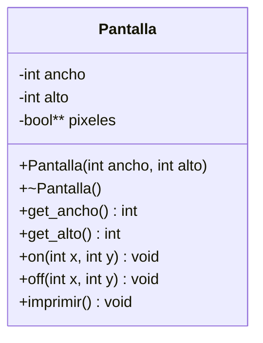

# B3 – Pantalla

## Diagrama de flujo

```mermaid
flowchart TD
    A([Inicio]) --> B["crear Pantalla 10 x 6<br/>matriz dinámica bool**"]
    B --> C[/imprimir pantalla/]
    C --> D[/leer X, Y/]
    D --> E["pantalla.on(x, y)"]
    E --> F[/imprimir pantalla/]
    F --> G{¿Encender una casilla más?}
    G -- s --> D
    G -- n --> H["destruir Pantalla<br/>liberar filas y matriz"]
    H --> I([Fin])
```

## Diagrama de clase

```mermaid
classDiagram
    class Pantalla {
        -int ancho
        -int alto
        -bool** pixeles
        +Pantalla(int ancho, int alto)
        +~Pantalla()
        +get_ancho() int
        +get_alto() int
        +on(int x, int y) void
        +off(int x, int y) void
        +imprimir() void
    }
```
